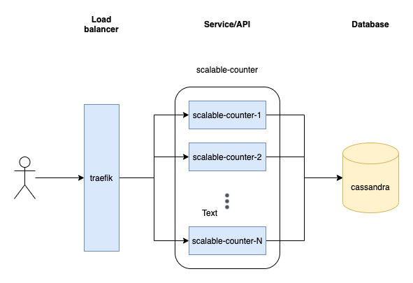

# scalable-counter
> A GENEPLANET tech assignment

## Task description

Create a system of services where each request to the services is counted and stored into DB.
System should consist of one DB instance, N instances of counter services and a load balancer.

## Solution overview



#### Load balancer: [Traefik](https://traefik.io/traefik/)

I have chosen Traefik as the load balancer for it's ease of configuration as it automatically picks 
up any containers that are annotated with Traefik specific Docker labels. Therefore when scaling up 
the containers there is no need to adjust any host list for the load balancer to work.

Traefik is meant to intercept every inbound request and then route it to correct services. We define 
this behaviour by adding rules to the Docker service description:

```yaml
labels:
  - "traefik.enable=true"
  - "traefik.http.routers.scalable-counter.rule=PathPrefix(`/scalable-counter/v1`)"
  - "traefik.http.middlewares.scalable-counter-stripprefix.stripprefix.prefixes=/scalable-counter/v1"
  - "traefik.http.middlewares.scalable-counter-stripprefix.stripprefix.forceSlash=false"
  - "traefik.http.routers.scalable-counter.middlewares=scalable-counter-stripprefix@docker"
```

This tells Traefik to route inbound requests to this service when path prefix is equal to `/scalable-counter/v1`
and to strip this prefix before routing the request to the end service.

#### Service/API: 

A simple Web API service developed in .Net 5.0 that exposes only one endpoint, that increases it's counter in the 
database and the returns all the counter in the database.

Every service is identified by it's IP address, which is used as the counter id.

#### Database: [Cassandra](https://cassandra.apache.org)

I have chosen Cassandra as the database as it provides a `counter` type out-of-the-box and is therefore specialized 
for the operations (_increment_) defined for this task.

Definition of the counter table:

```sql
CREATE TABLE counters
(
    id         text,
    count      counter,
    PRIMARY KEY (id)
);
```

## Prerequisites

- .NET 5.0
- Docker

## Usage

Run the following `docker-compose` command in the root directory of the solution:

`docker-compose up -d --scale scalable-counter=3`

Docker will automatically build and setup everything for you.

When containers are up and running you can access the API:

`curl --location --request GET 'http://localhost/scalable-counter/v1/Counters'`

This should produce a result of the following form:

```json
[
  {
    "id":"192.168.48.4",
    "count":16
  },
  {
    "id":"192.168.48.9",
    "count":20
  },
  {
    "id":"192.168.48.7",
    "count":21
  }
]
```